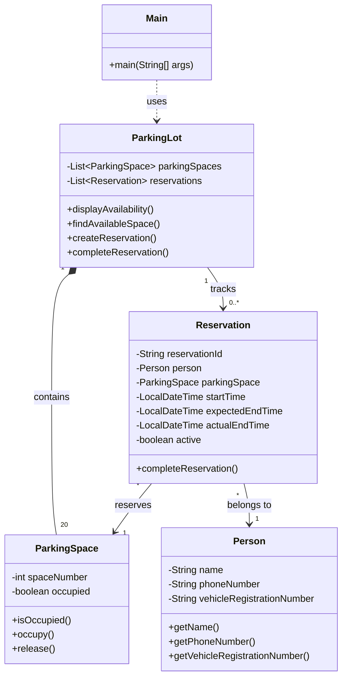

```mermaid
classDiagram
    class Person {
        -String name
        -String phoneNumber
        -String vehicleRegistrationNumber
        +getName()
        +getPhoneNumber()
        +getVehicleRegistrationNumber()
    }

    class ParkingSpace {
        -int spaceNumber
        -boolean occupied
        +isOccupied()
        +occupy()
        +release()
    }

    class Reservation {
        -String reservationId
        -Person person
        -ParkingSpace parkingSpace
        -LocalDateTime startTime
        -LocalDateTime expectedEndTime
        -LocalDateTime actualEndTime
        -boolean active
        +completeReservation()
    }

    class ParkingLot {
        -List~ParkingSpace~ parkingSpaces
        -List~Reservation~ reservations
        +displayAvailability()
        +findAvailableSpace()
        +createReservation()
        +completeReservation()
    }

    class Main {
        +main(String[] args)
    }

    ParkingLot "1" *-- "20" ParkingSpace : contains
    ParkingLot "1" --> "0..*" Reservation : tracks
    Reservation "*" --> "1" Person : belongs to
    Reservation "*" --> "1" ParkingSpace : reserves
    Main ..> ParkingLot : uses
```