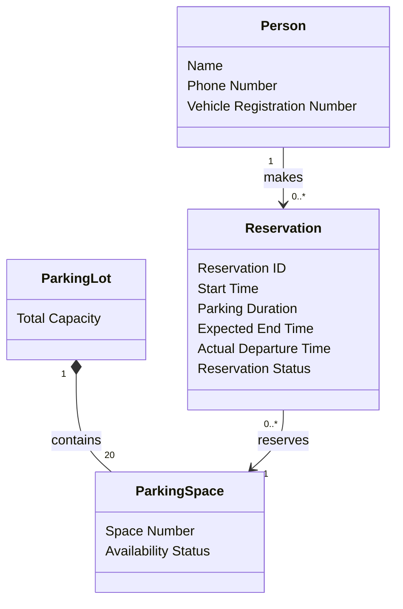

```mermaid

classDiagram
    class Person {
        Name
        Phone Number
        Vehicle Registration Number
    }

    class ParkingLot {
        Total Capacity
    }

    class ParkingSpace {
        Space Number
        Availability Status
    }

    class Reservation {
        Reservation ID
        Start Time
        Parking Duration
        Expected End Time
        Actual Departure Time
        Reservation Status
    }

    ParkingLot "1" *-- "20" ParkingSpace : contains
    Person "1" --> "0..*" Reservation : makes
    Reservation "0..*" --> "1" ParkingSpace : reserves
```